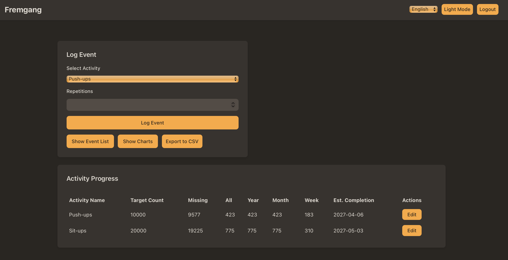

# Fremgang (Norwegian for "Progress")

A full-stack web application for tracking training activities, setting targets, visualizing progress, and managing events.

This application was inspired by Jason Gilmore's article "10,000 Pushups And Other Silly Exercise Quests That Changed My Life", available at [https://wjgilmore.com/articles/10000-pushups](https://wjgilmore.com/articles/10000-pushups).

## Features

-   **User Authentication:** Secure registration and login with email and password.
-   **Activity Tracking:** Register various training activities (e.g., Push-ups, Sit-ups).
-   **Event Logging:** Log repetitions for activities with timestamps.
-   **Target Counts:** Set and track target repetition counts for each activity.
-   **Progress Visualization:** Interactive charts (volume over time, time of day patterns) for selected activities.
-   **Event Management:** View, edit, and delete past training events.
-   **Data Export:** Export all training data to CSV format.
-   **Multi-language Support:** English, Norwegian, and Spanish.
-   **Theme Switching:** Dark and Light mode.
-   **Responsive Design:** Works well on both mobile and desktop.

## Screenshot



*The dashboard view of the Fremgang application, showcasing the user interface for tracking activities, logging events, and visualizing progress with interactive charts.*

## Technologies Used

-   **Frontend:** Svelte, SvelteKit, TypeScript, Chart.js, i18next
-   **Backend:** Node.js, Express.js, SQLite3, bcrypt, jsonwebtoken

## Getting Started

Follow these steps to set up and run the project locally.

### Prerequisites

-   Node.js (LTS version recommended)
-   npm (Node Package Manager)

### Installation

1.  **Clone the repository:**
    ```bash
    git clone <repository-url>
    cd fremgang-wip-maal
    ```

2.  **Install Dependencies:**
    ```bash
    npm install
    ```
    This will install the dependencies for the root, server, and client-svelte projects.

## Building for Production

To create a production-ready build of the application:

1.  **Navigate to the root of the project.**
2.  **Run the build script:**
    ```bash
    npm run build
    ```
    This command will:
    -   Create an optimized static build of the Svelte frontend in the `client-svelte/build` directory.
    -   Compile the TypeScript backend code into JavaScript in the `server/dist` directory.

## Running the Application

### Development

For a development environment with live reloading for both the frontend and backend:

1.  **Navigate to the root of the project.**
2.  **Run the development start script:**
    ```bash
    npm run start:dev
    ```
    This will start the Svelte development server and the Node.js server simultaneously. The application will be accessible at `http://localhost:5173`.

### Production

After building the application (see "Building for Production"), you can run the production version:

1.  **Navigate to the root of the project.**
2.  **Start the server:**
    ```bash
    npm start
    ```
    This will start the Node.js server, which will serve the optimized frontend build. The application will be accessible at `http://localhost:3010` (or the port specified in `server/src/index.ts`).

### CLI Password Change

To change a user's password via the command line:

1.  Navigate to the `server` directory.
2.  Run:
    ```bash
    npm run change-password -- <user-email> <new-password>
    ```
    (e.g., `npm run change-password -- user@example.com newSecurePass123`)
